### Building an E-Learning

The project was built while following *Django 5 By Example* by Antonio Melé.

Note: When you use a cmd make sure you have the same path then your editor.

### Chapter 12. Building an E-Learning Platform

## In this chapter, you will learn how to:
- Create models for the CMS
- Create fixtures for your models and apply them
- Use model inheritance to create data models for polymorphic content
- Create custom model fields
- Order course contents and modules
- Build authentication views for the CMS

## Set up:
# Create a virtual environment
- python -m venv env/educa

# Activate your virtual environment
- .\env\educa\Scripts\activate

# Install Django
- python -m pip install Django~=5.0.4

# Install Pillow
- python -m pip install Pillow==10.3.0

# Create a startproject
- django-admin startproject educa

# Create a startapp
- django-admin startapp courses

# settings.py
- Add `courses.apps.CoursesConfig` to `INSTALLED\_APPS`

### Serving media files

# Update settings.py
- MEDIA_URL = 'media/'
- MEDIA_ROOT = BASE_DIR / 'media'

### Building the course models

## The Course model fields are as follows:
- owner
- subject
- Subject model
- title
- slug
- overview
- created

# Initial migration
- python manage.py makemigrations
- python manage.py migrate

### Registering the models in the administration site

### Using fixtures to provide initial data for models

# create a superuser
- python manage.py createsuperuser
- Username (leave blank to use 'admin'): admin
- Email address: admin@admin.com
- Password: ********
- Password (again): ********

# run the development server on cmd
- python manage.py runserver

## Create several subjects using the administration site.

### Figure 12.1 The subject change list view on the administration site

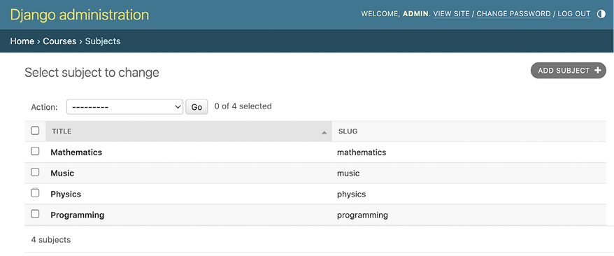

Figure 12.1 The subject change list view on the administration site

# Run the following command from the shell:
- python manage.py dumpdata courses --indent=2

## Save this dump to a fixtures file in a new fixtures/ directory in the courses application
- mkdir courses/fixtures
- python manage.py dumpdata courses --indent=2 --output=courses/fix

test'''
After you run the syntax above, inside the courses folder you will see a folder named ‘fixtures’ and a files named :{}fix. Rename the file  from {}fix to {}subjects.json, after drag the file inside of ‘fixture’ folder.
'''
### Figure 12.2 Deleting all existing subjects

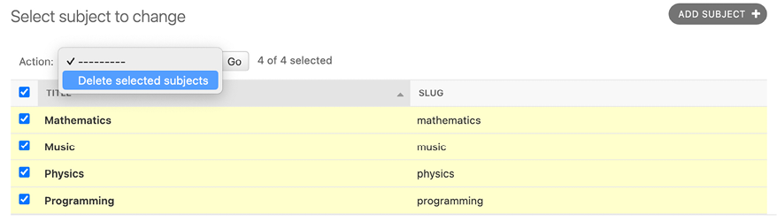

Figure 12.2 Deleting all existing subjects

# After deleting all subjects, load the fixture into the database
- python manage.py loaddata subjects.json

### Figure 12.3 Subjects from the fixture are now loaded into the database

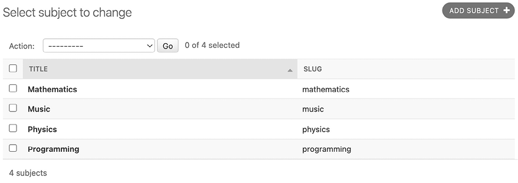

Figure 12.3 Subjects from the fixture are now loaded into the database

### Creating models for polymorphic content

## In your Content model, these are:
- content_type : A ForeignKey field to the ContentType model
- object_id : A PositiveIntegerField to store the primary key of the related object
- item : A GenericForeignKey field to the related object combining the two previous fields

### Using model inheritance

## Django offers the following three options to use model inheritance:
- Abstract models
- Multi-table model inheritance
- Proxy models

## Abstract models

### Figure 12.4 Sample models and database tables for inheritance using abstract models

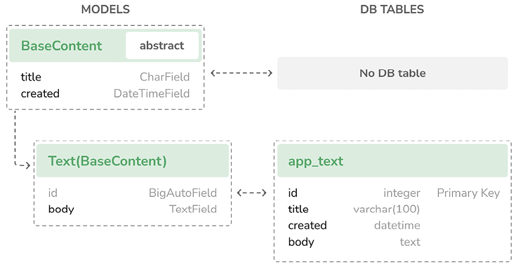

Figure 12.4 Sample models and database tables for inheritance using abstract models

### Multi-table model inheritance

### Figure 12.5 Sample models and database tables for multi-table model inheritance

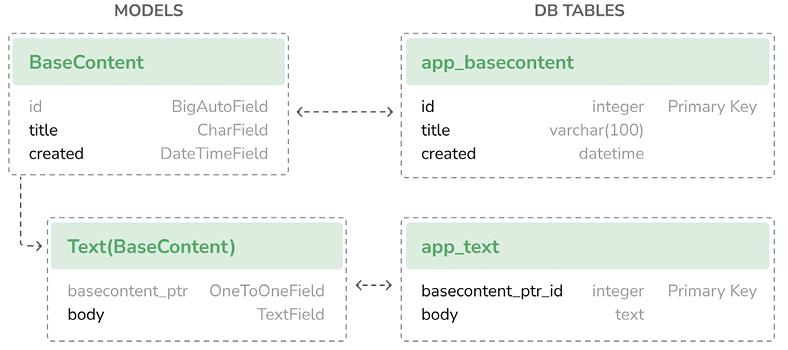

Figure 12.5 Sample models and database tables for multi-table model inheritance

## Proxy models

### Figure 12.6 Sample models and database tables for inheritance using proxy models

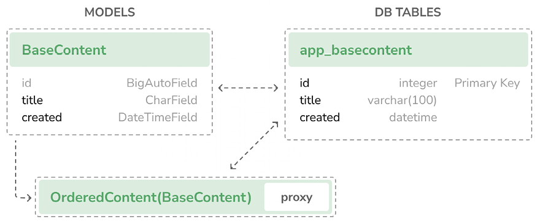

Figure 12.6 Sample models and database tables for inheritance using proxy models

### Creating the Content models

## You have defined four different Content models that inherit from the
- ItemBase abstract model. They are as follows:
- Text 
- File 
- Image 
- Video 

### Figure 12.7 Content models and associated database tables

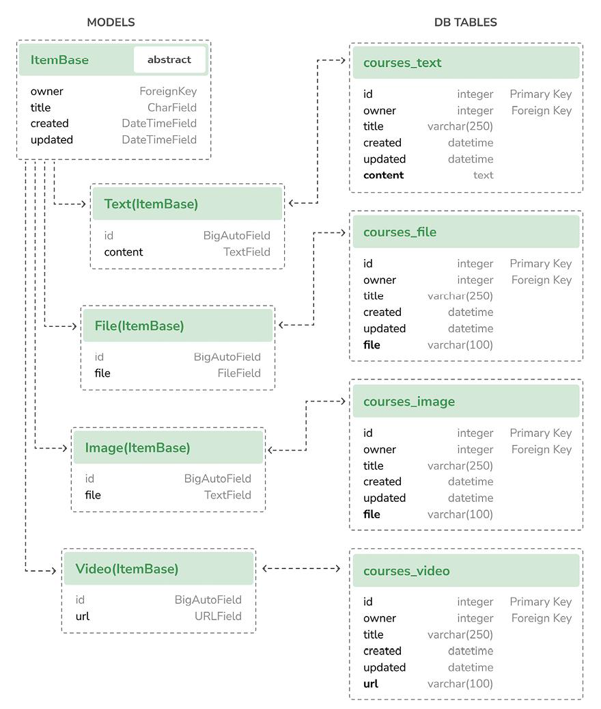

Figure 12.7 Content models and associated database tables

# Migration 
- python manage.py makemigrations
- python manage.py migrate

### Creating custom model fields

## There are two relevant functionalities that you will build into your order field:
- Automatically assign an order value when no specific order is provided
- Order objects with respect to other fields: 
    
### Adding ordering to Module and Content objects

# Migration
- python manage.py makemigrations courses
- python manage.py migrate

# Open the shell to test
- python manage.py shell

### Adding authentication views

## Adding an authentication system

## Creating the authentication templates

# Create the following file structure inside the courses application directory:
templates/
        base.html
        registration/
                 login.html
                 logged_out.html

## In this template, you define the following blocks:
- title 
- content 
- domready 
- DOMContentLoaded event

# Open http://127.0.0.1:8000/accounts/login/ in your browser.
- python manage.py runserver

# Open http://127.0.0.1:8000/accounts/login/ in your browser. 

### Figure 12.8 The account login page

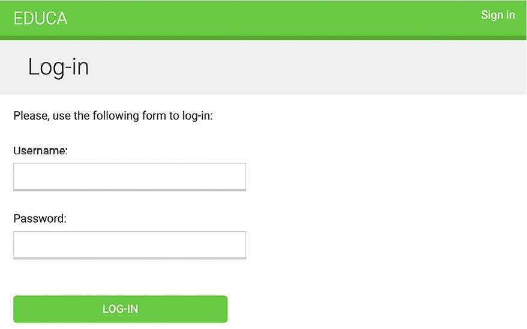

Figure 12.8 The account login page

### Figure 12.9 The account Logged out page

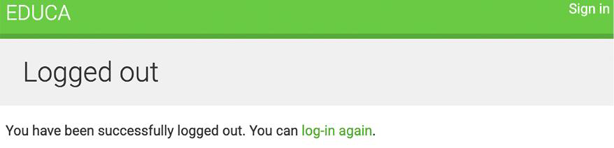

Figure 12.9 The account Logged out page

---

### Chapter 13. Creating a Content Management System

## In this chapter, you will learn how to:
- Create a content management system (CMS) using class-based views and mixins
- Build formsets and model formsets to edit course modules and module contents
- Manage groups and permissions
- Implement a drag-and-drop functionality to reorder modules and content

## Functional overview

### Figure 13.1 Diagram of functionalities built in Chapter 13

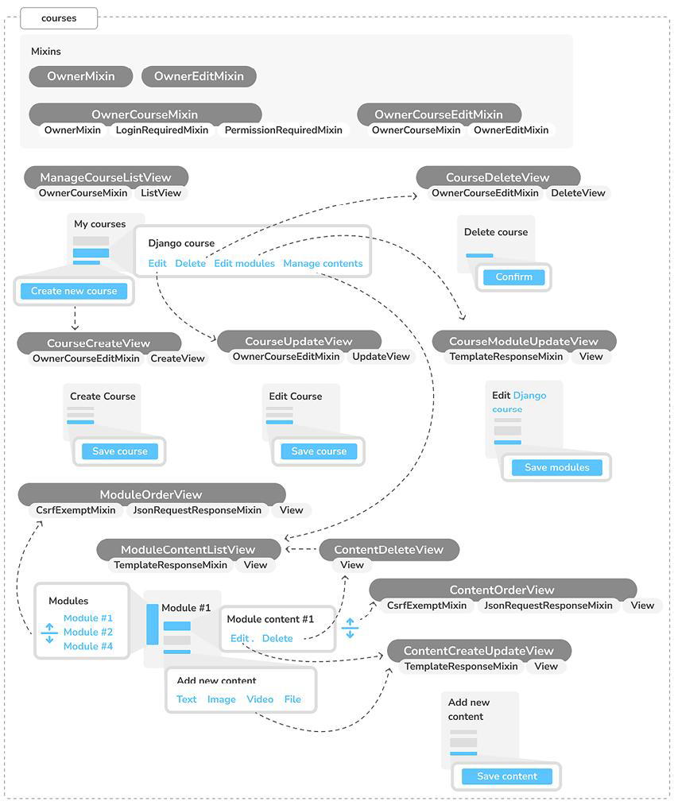

Figure 13.1 Diagram of functionalities built in Chapter 13

### Creating a CMS

## You need to provide the following functionality:
- List the courses created by the instructor
- Create, edit, and delete courses
- Add modules to a course and reorder them
- Add different types of content to each module
- Reorder course modules and content

## Creating class-based views

### Using mixins for class-based views

## There are two main situations for using mixins:
- You want to provide multiple optional features for a class
- You want to use a particular feature in several classes

## OwnerMixin and provides the following attributes for child views:
- model 
- fields 
- success_url 

## You define an OwnerCourseEditMixin mixin with the following attribute:
- template_name 

## Finally, you create the following views that subclass OwnerCourseMixin :
- ManageCourseListView 
- CourseCreateView 
- CourseUpdateView 
- CourseDeleteView 

### Working with groups and permissions

# Open http://127.0.0.1:8000/admin/auth/group/add/ in your browser 

### Figure 13.2 The Instructors group permissions

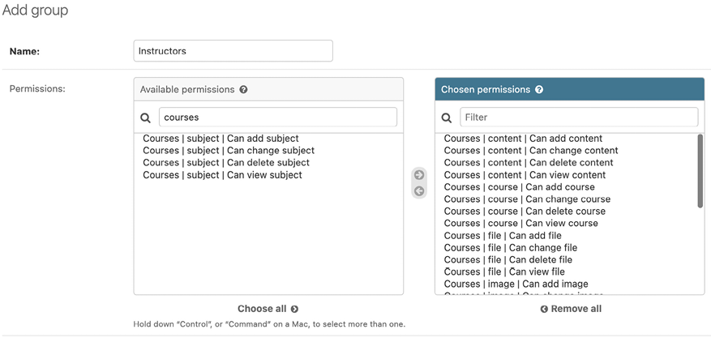

Figure 13.2 The Instructors group permissions

### Figure 13.3 User group selection

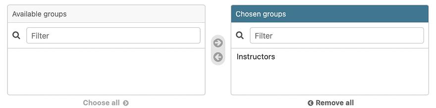

Figure 13.3 User group selection

### Restricting access to class-based views

## django.contrib.auth limit access to two mixins to views:
- LoginRequiredMixin 
- PermissionRequiredMixin 

## You need to create the templates/ courses application:
courses/
    manage/
     course/
         list.html
         form.html
         delete.html

# Open http://127.0.0.1:8000/accounts/login/?next=/course/mine/

### Figure 13.4 The instructor courses page with no courses

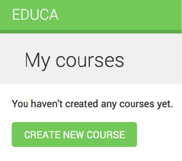

Figure 13.4 The instructor courses page with no courses

# Open http://127.0.0.1:8000/course/mine/

### Figure 13.5 The form to create a new course

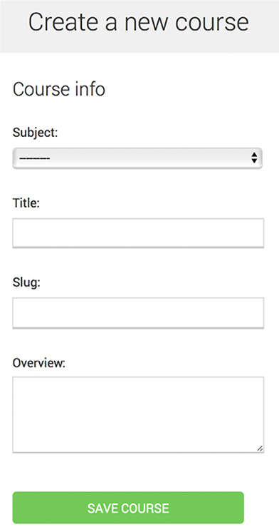

Figure 13.5 The form to create a new course

### Figure 13.6 The instructor courses page with one course

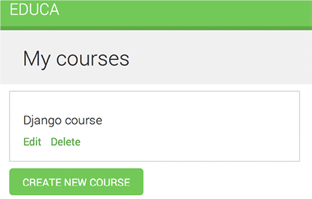

Figure 13.6 The instructor courses page with one course

### Figure 13.7 The Delete course confirmation page

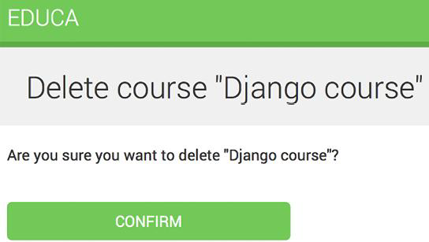

Figure 13.7 The Delete course confirmation page

### Managing course modules and their contents

## Using formsets for course modules

## You use the following parameters to build the formset:
- fields 
- extra 
- can_delete 

## This view inherits from the following mixins and views:
- TemplateResponseMixin 
- View : The basic class-based view provided by Django. 

## In this view, you implement the following methods:
- get_formset() 
- dispatch() 
- get() 	
- post() : Executed for POST requests. In this method, you perform the following actions:

## Edit the courses/manage/course/list.html template and Delete links:

# Open http://127.0.0.1:8000/course/mine/ 

### Figure 13.8 The course edit page, including the formset for course modules

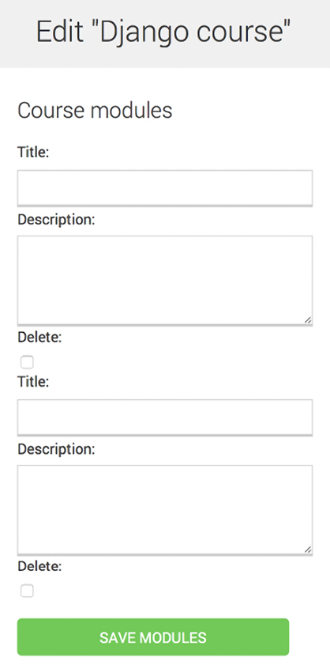

Figure 13.8 The course edit page, including the formset for course modules

### Adding content to course modules
   
## This is the first part of ContentCreateUpdateView . 
- get_model() 
- get_form() 
- dispatch() : This receives the following URL parameters and stores the corresponding module. 
	- module_id 
	- model_name 
	- id 

### Add the following get() and post() methods to ContentCreateUpdateView :

## These methods are as follows:
- get() 
- post() 

## The new URL patterns are as follows:
- module_content_create 
- module_content_update 

## Create a new directory courses/manage/content/form.html 
- click Edit modules for an existing course, and create a module.

# Open the Python shell

# Open http://127.0.0.1:8000/course/mine/ Then, open the Python shell with the following command:
python manage.py shell
- python manage.py shell
- Obtain the ID of the most recently created module
- >>> from courses.models import Module
- >>> Module.objects.latest('id').id
- 1

# Open http://127.0.0.1:8000/course/module/1/content/image/create/ 

### Figure 13.9 The course Add new content form

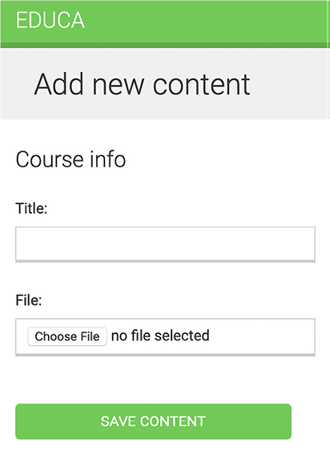

Figure 13.9 The course Add new content form

### Managing modules and their contents

# Stop the development server Ctrl + C and run it again
- python manage.py runserver

# Open http://127.0.0.1:8000/course/mine/ 

### Figure 13.10 The page to manage course module contents

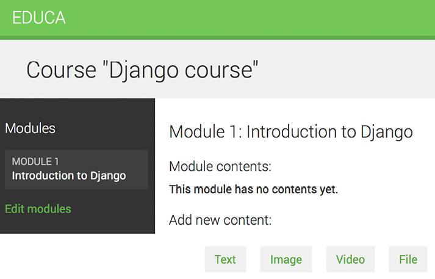

Figure 13.10 The page to manage course module contents

### Figure 13.11 Managing different module contents

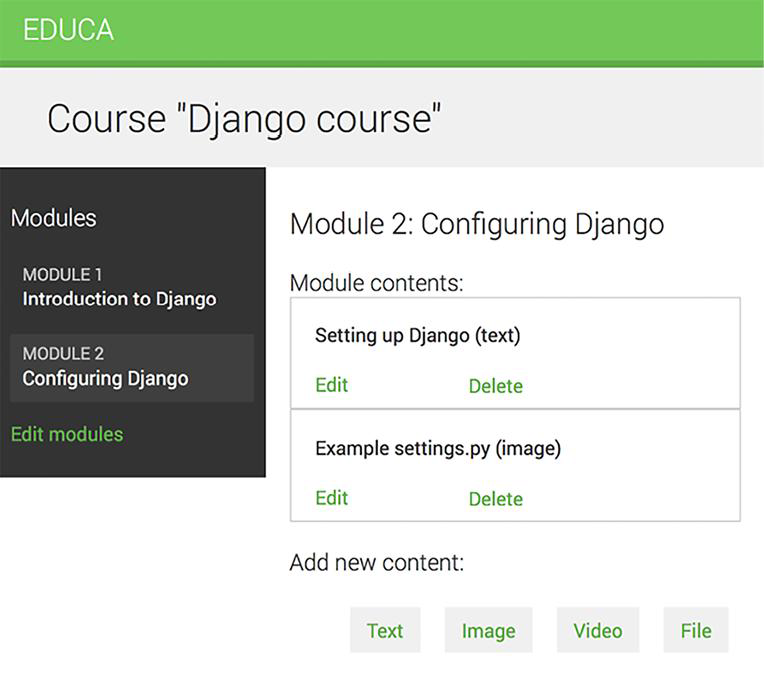

Figure 13.11 Managing different module contents

### Reordering modules and their contents

### Using mixins from djangobraces

## You will use the following mixins of django-braces :
- CsrfExemptMixin
- JsonRequestResponseMixin 

# Install django-braces via pip using the following command:
- python -m pip install django-braces==1.15.0

# Open http://127.0.0.1:8000/course/mine/ 

### Figure 13.12 Reordering modules with the drag-and-drop functionality

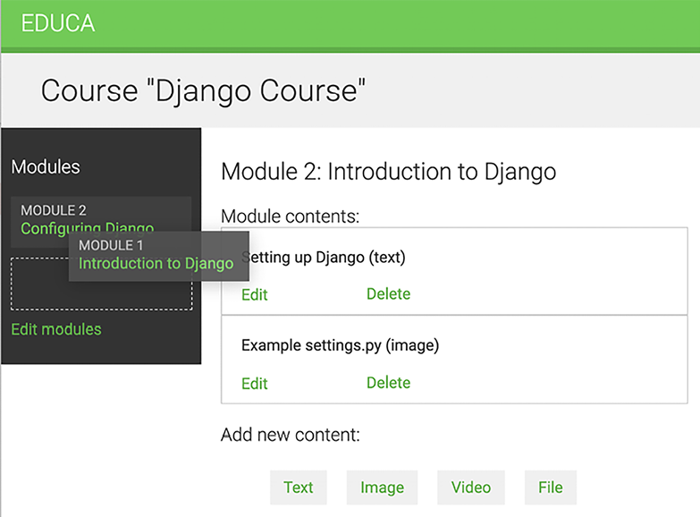

Figure 13.12 Reordering modules with the drag-and-drop functionality

## The following tasks are performed in the event function:

1. An empty modulesOrder dictionary is created. 

2. The list elements of the #modules HTML element are selected with document.querySelectorAll().
3. forEach() is used to iterate over each list element. 

4. The new index for each module is stored in the modulesOrder dictionary. 

5. The order displayed for each module is updated by selecting the element with the order CSS class.
 
6. A key named body is added to the options dictionary with the new order contained in modulesOrder. 

7. The Fetch API is used by creating a fetch() HTTP request to update the module order. 

## We can now drag and drop modules. 

### Figure 13.13 New order for modules after reordering them with drag and drop

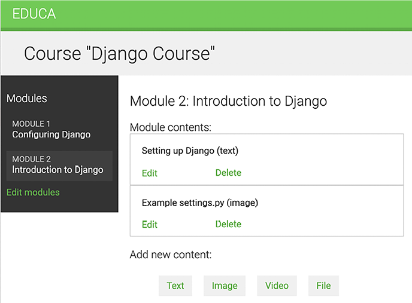

Figure 13.13 New order for modules after reordering them with drag and drop

### Figure 13.14 Reordering module contents with the drag-and-drop functionality

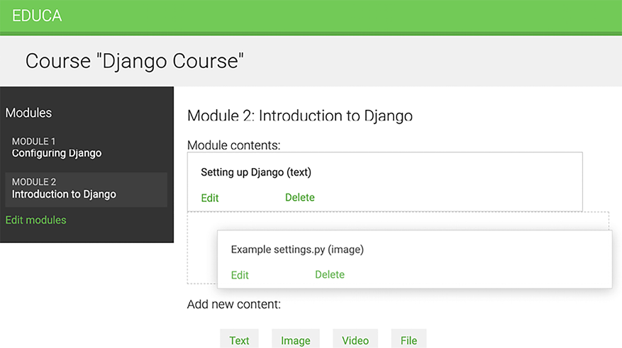

Figure 13.14 Reordering module contents with the drag-and-drop functionality

---

### Chapter 14. Rendering and Caching Content

## In this chapter, you will:

- Create public views for displaying course information
- Build a student registration system
- Manage student enrollment in courses
- Render diverse content for course modules
- Install and configure Memcached
- Cache content using the Django cache framework
- Use the Memcached and Redis cache backends
- Monitor your Redis server in the Django administration site

### Functional overview

### Figure 14.1 Diagram of functionalities built in Chapter 14

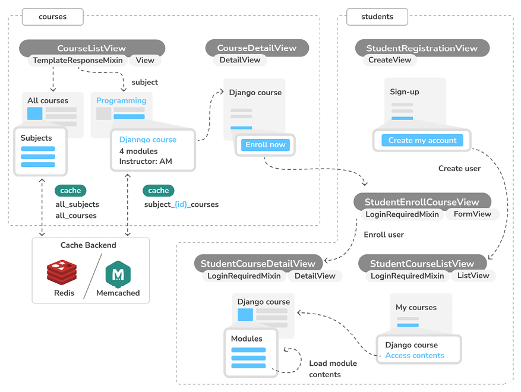

Figure 14.1 Diagram of functionalities built in Chapter 14

## Displaying the catalog of courses

## For your course catalog, you have to build the following functionalities:
- List all available courses, optionally filtered by subject
- Display a single course overview

### Figure 14.2 The course list page

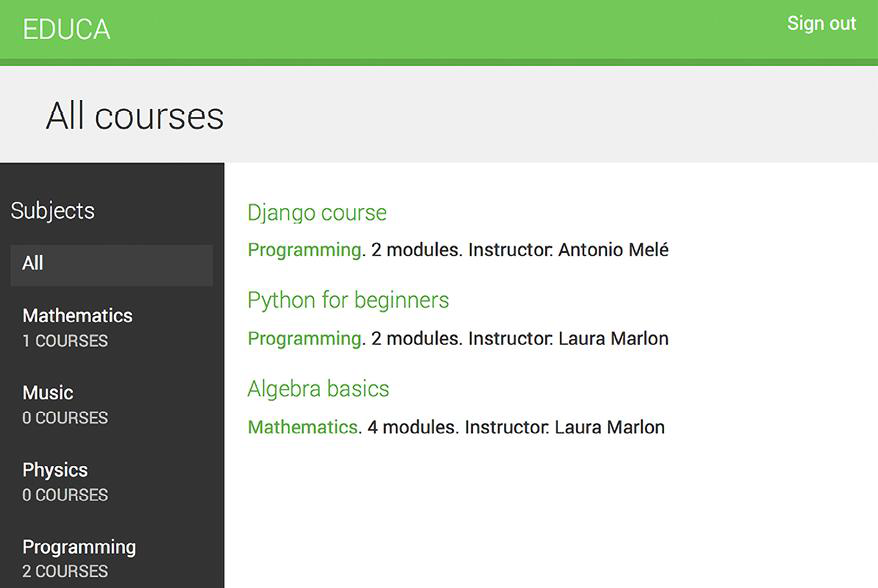

Figure 14.2 The course list page

# Open http://127.0.0.1:8000/ 

### Figure 14.3 The course overview page

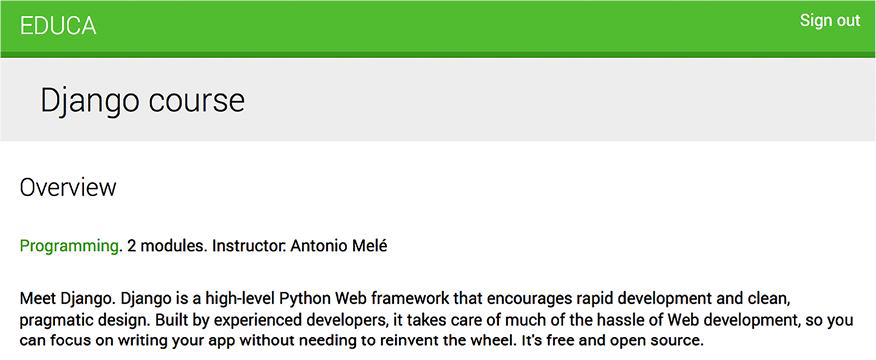

Figure 14.3 The course overview page

# Adding student registration
- python manage.py startapp students

# settings.py
- Add `students.apps.StudentsConfig` to `INSTALLED_APPS`

### Creating a student registration view

## This view requires the following attributes:
- template_name 
- form_class 
- success_url 

## Create the following file structure inside the students application directory:
templates/
        students/
               student/
                      registration.html

# Open http://127.0.0.1:8000/students/register/  

### Figure 14.4 The student registration form

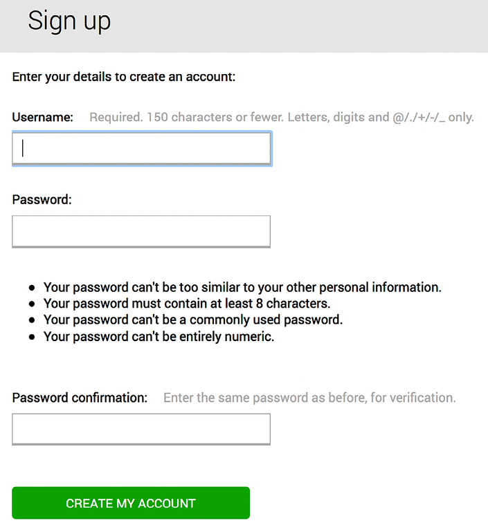

Figure 14.4 The student registration form

### Enrolling in courses
// Migration
- python manage.py makemigrations
- python manage.py migrate

### Figure 14.5 The course overview page, including an ENROLL NOW button

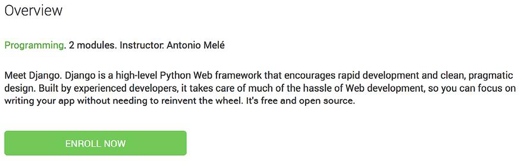

Figure 14.5 The course overview page, including an ENROLL NOW button

### Rendering course contents

## Accessing course contents

### Rendering different types of content

## Create the following file structure inside the templates/courses/ directory of the courses application:
content/
          text.html
          file.html
          image.html
          video.html

# Install the package with the following command:
- python -m pip install django-embed-video   RUN THIS ONE INSTEAD, NO PROBLEM

# Update settings.py
- Add `embed_video` to `INSTALLED_APPS`

# Open http://127.0.0.1:8000/course/mine/ in your browser. 
- python manage.py runserver

# Open http://127.0.0.1:8000/ 

### Figure 14.6 A course contents page

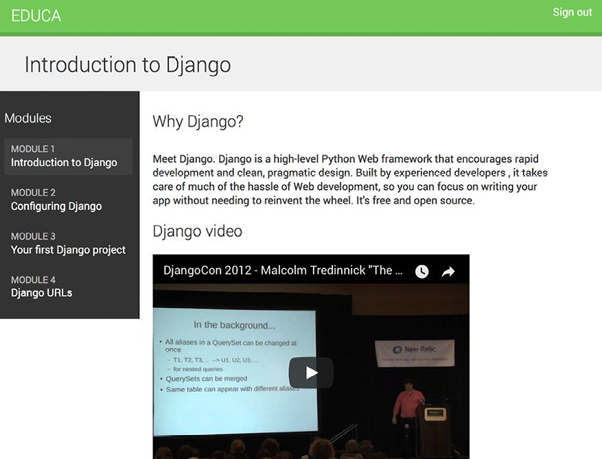

Figure 14.6 A course contents page

### Using the cache framework

## How the cache framework is usually used when your application processes an HTTP request:

1. Try to find the requested data in the cache.

2. If found, return the cached data.

3. If not found, perform the following steps:
	a. Perform the database query or processing required to generate the data.
	b. Save the generated data in the cache.
	c. Return the data.

### Available cache backends

## Django comes with the following cache backends:
- backends.memcached.PyMemcacheCache or backends.memcached.PyLibMCCache 
- backends.redis.RedisCache 
- backends.db.DatabaseCache 
- backends.filebased.FileBasedCache 
- backends.locmem.LocMemCache 
- backends.dummy.DummyCache  

### Installing Memcached

# Installing the Memcached Docker image 
- docker pull memcached:1.6.26

# Run
- docker run -it --rm --name memcached -p 11211:11211 memcached:1.6.26

# Installing the Memcached Python binding
- python -m pip install pymemcache==4.0.0

### Django cache settings

## Django provides the following cache settings:
- CACHES : A dictionary containing all available caches for the project.
- CACHE_MIDDLEWARE_ALIAS 
- CACHE_MIDDLEWARE_KEY_PREFIX 
- CACHE_MIDDLEWARE_SECONDS 

## This setting allows you to specify the configuration for multiple caches. 
- BACKEND 
- KEY_FUNCTION 
- KEY_PREFIX 
- LOCATION 
- OPTIONS 
- TIMEOUT 
- VERSION : The default version number for the cache keys. Useful for cache versioning.

## Adding Memcached to your project

# Update settings.py
- CACHES = {
-     'default': {
-         'BACKEND': 'django.core.cache.backends.memcached.PyMemcacheCache',
-         'LOCATION': '127.0.0.1:11211',
-     }
- }

### Cache levels

## Listed here by ascending order of granularity:
- Low-level cache API
- Template cache
- Per-view cache
- Per-site cache

# Open the Python shell to test
- python manage.py shell

### Checking cache requests with Django Debug Toolbar

# Install Django Debug Toolbar with the following command:
- python -m pip install django-debug-toolbar==4.3.0

# Update settings.py
- Add `debug_toolbar` to `INSTALLED_APPS`
- Add `debug_toolbar.middleware.DebugToolbarMiddleware` to `MIDDLEWARE`
- Add `'127.0.0.1' to `INTERNAL_IPS`

# Open http://127.0.0.1:8000/ in your browser.

### Figure 14.7 The Cache panel of Django Debug Toolbar including cache requests for CourseListView on a cache miss

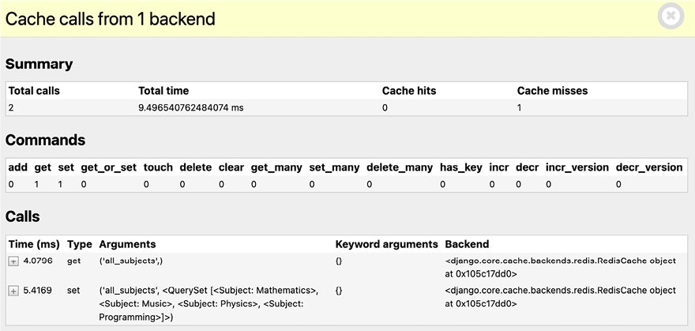

Figure 14.7 The Cache panel of Django Debug Toolbar including cache requests for CourseListView on a cache miss

### Figure 14.8 SQL queries executed for CourseListView on a cache miss

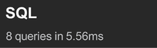

Figure 14.8 SQL queries executed for CourseListView on a cache miss

### Figure 14.9 The Cache panel of Django Debug Toolbar, including cache requests for the CourseListView view on a cache hit

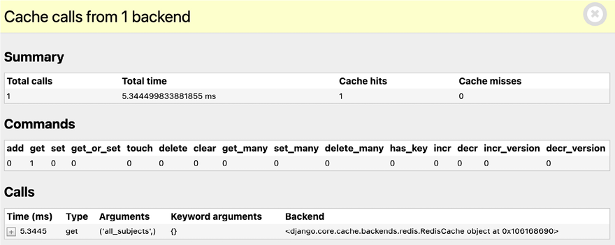

Figure 14.9 The Cache panel of Django Debug Toolbar, including cache requests for the CourseListView view on a cache hit

### Figure 14.10 SQL queries executed for CourseListView on a cache hit

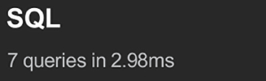

Figure 14.10 SQL queries executed for CourseListView on a cache hit

### Low-level caching based on dynamic data

### Caching template fragments 

### Caching views

### Using the per-site cache

# Update settings.py
- Add `django.middleware.cache.UpdateCacheMiddleware` to `MIDDLEWARE`
- Add `django.middleware.cache.FetchFromCacheMiddleware'` to `MIDDLEWARE`
- Add CACHE_MIDDLEWARE_ALIAS = 'default'
- Add CACHE_MIDDLEWARE_SECONDS = 60 * 15  # 15 minutes
- Add CACHE_MIDDLEWARE_KEY_PREFIX = 'educa'

# Update settings.py
- Add `# 'django.middleware.cache.UpdateCacheMiddleware' to `MIDDLEWARE`
- Add `# 'django.middleware.cache.FetchFromCacheMiddleware' to `MIDDLEWARE`

### Using the Redis cache backend

# Install redis-py in your environment:
- python -m pip install redis==5.0.4

# Update settings.py
- CACHES = {
-     'default': {
-        'BACKEND': 'django.core.cache.backends.redis.RedisCache',
-         'LOCATION': 'redis://127.0.0.1:6379',
-     }
- }

# Initialize the Redis Docker container using the following command:
- docker run -it --rm --name redis -p 6379:6379 redis:7.2.4

# Open http://127.0.0.1:8000/ in your browser. 

### Monitoring Redis with Django Redisboard

# Install django-redisboard in your environment:
- python -m pip install django-redisboard==8.4.0

# Update settings.py
- Add `redisboard` to `INSTALLED_APPS`

# Migrations:
- python manage.py migrate redisboard

# Open http://127.0.0.1:8000/admin/redisboard/redisserver/add/ in your browser 

### Figure 14.11 The form to add a Redis server for Django Redisboard in the administration site

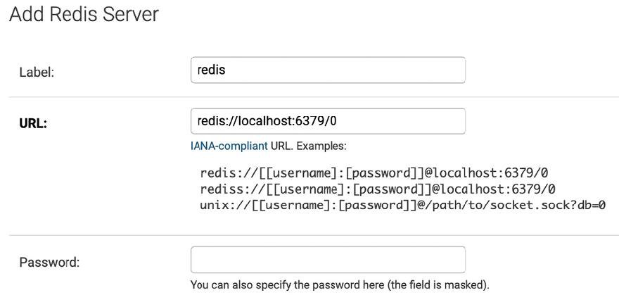

Figure 14.11 The form to add a Redis server for Django Redisboard in the administration site

### Figure 14.12 The Redis monitoring of Django Redisboard on the administration site

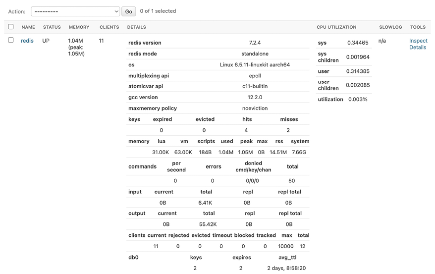

Figure 14.12 The Redis monitoring of Django Redisboard on the administration site

---

### Chapter 15. Building an API

## In this chapter, you will:
- Install Django REST framework
- Create serializers for your models
- Build a RESTful API
- Implement serializer method fields
- Create nested serializers
- Implement ViewSet views and routers
- Build custom API views
- Handle API authentication
- Add permissions to API views
- Create custom permissions
- Use the Requests library to consume the API

### Functional overview 

### Figure 15.1 Diagram of API views and endpoints to be built in Chapter 15

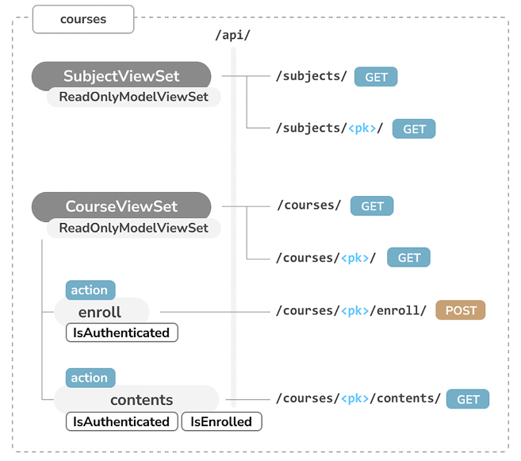

Figure 15.1 Diagram of API views and endpoints to be built in Chapter 15

### Building a RESTful API

## Your API will provide the following functionalities:
- Retrieving subjects
- Retrieving available courses
- Retrieving course contents
- Enrolling in a course

text'''
You can build an API from scratch with Django by creating custom views. However, there are several third-party modules that simplify creating an API for your project; the most popular among them is Django REST framework (DRF).
'''
## DRF provides a comprehensive set of tools to build RESTful APIs for your projects. 
- Serializers
- Parsers and renderers
- API views
- URLs
- Authentication and permissions

### Installing Django REST framework
- python -m pip install djangorestframework==3.15.1

# Update settings.py
- Add `rest_framework` to `INSTALLED_APPS`
- REST_FRAMEWORK = {
-     'DEFAULT_PERMISSION_CLASSES': [
-         'rest_framework.permissions.DjangoModelPermissionsOrAnonReadOnly'
-     ]
- }

### Defining serializers

## The framework provides the following classes to build serializers for single objects:
- Serializer 
- ModelSerializer 
- HyperlinkedModelSerializer 

## Create the following file structure inside the courses application directory:
api/
     __init__.py
     serializers.py

# Open the Python shell to test
- python manage.py shell

### Understanding parsers and renderers

# Open the Python shell to test
- python manage.py shell

### Building list and detail views

## In this code, you use the generic ListAPIView and RetrieveAPIView views of DRF. 
- queryset 
- serializer_class 

### Consuming the API

# Open http://127.0.0.1:8000/api/subjects/ in your browser. 

### Figure 15.2 The Subject List page in the REST framework browsable API

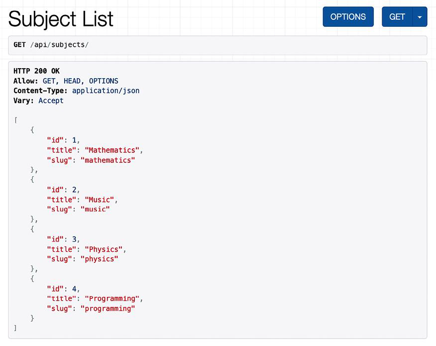

Figure 15.2 The Subject List page in the REST framework browsable API

# Open http://127.0.0.1:8000/api/subjects/1/ in your browser. 
 
### Figure 15.3 The Subject Detail page in the REST framework browsable API

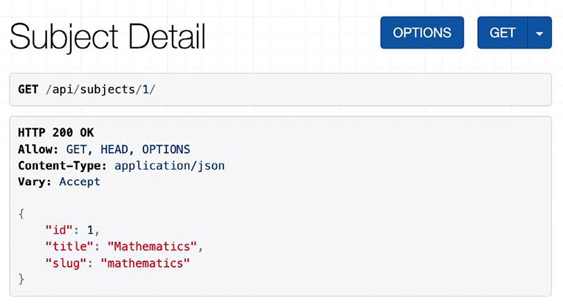

Figure 15.3 The Subject Detail page in the REST framework browsable API

### Extending serializers

## Adding additional fields to serializers

Open http://127.0.0.1:8000/api/subjects/1/ in your browser. 

### Figure 15.4 The Subject Detail page, including the total_courses attribute

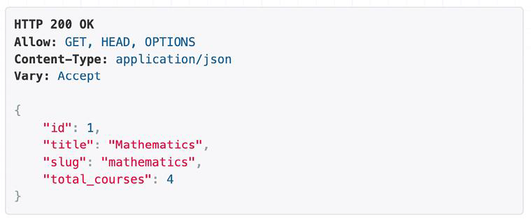

Figure 15.4 The Subject Detail page, including the total_courses attribute

### Implementing serializer method fields

# Open http://127.0.0.1:8000/api/subjects/1/ in your browser. 
 
### Figure 15.5 The subject detail page, including the popular_courses attribute

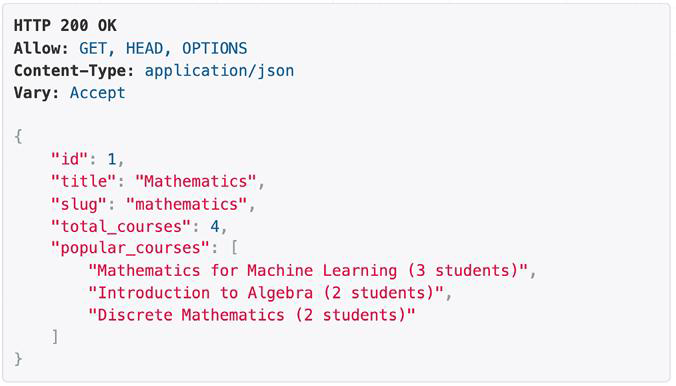

Figure 15.5 The subject detail page, including the popular_courses attribute

### Adding pagination to views

## This class provides support for pagination based on page numbers. We set the following attributes:
- page_size 
- page_size_query_params 
- max_page_size 

## The following items are now part of the JSON returned:
- count 
- next 
- previous 
- results 

# Open http://127.0.0.1:8000/api/subjects/?page_size=2&page=1 in your browser. 

### Figure 15.6 First page of results for the subject list pagination, with a page size of 2

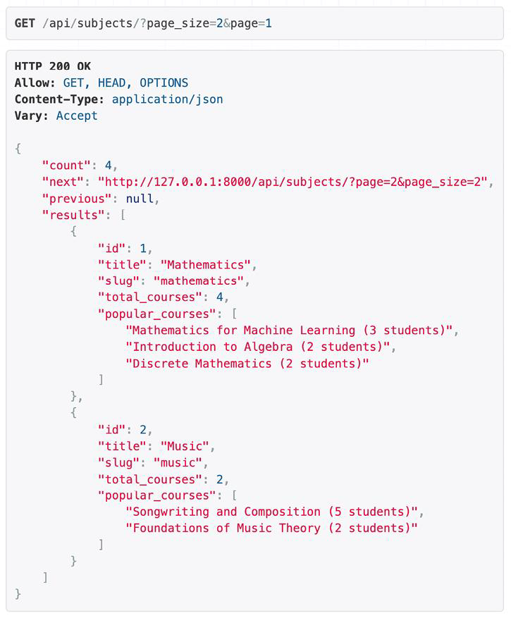

Figure 15.6 First page of results for the subject list pagination, with a page size of 2

### Building the course serializer

# Open the Python shell to test
- python manage.py shell

### Serializing relations

### Creating nested serializers

### Creating ViewSets and routers

## ViewSets allow you to define the interactions of your API and let DRF build URLs dynamically with a Router object. 
- Create operation: create()
- Retrieve operation: list() and retrieve()
- Update operation: update() and partial_update()
- Delete operation: destroy()

# Open http://127.0.0.1:8000/api/ in your browser. 

### Figure 15.7 The API Root page of the REST framework browsable API

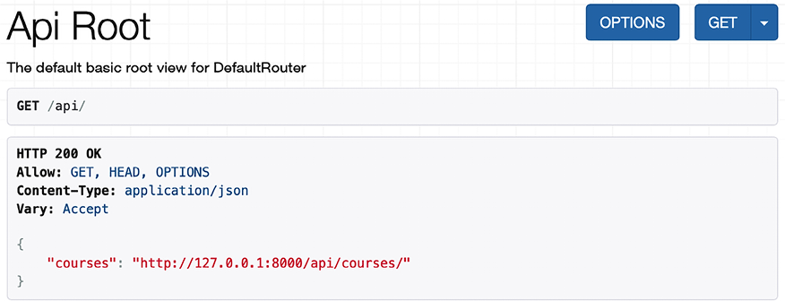

Figure 15.7 The API Root page of the REST framework browsable API

# Open http://127.0.0.1:8000/api/courses/ to retrieve the list of courses
 
### Figure 15.8 The Course List page in the REST framework browsable API

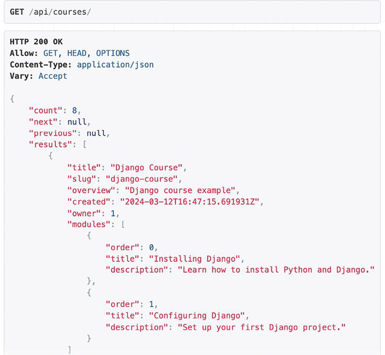

Figure 15.8 The Course List page in the REST framework browsable API

# Open http://127.0.0.1:8000/api/ in your browser. 

### Figure 15.9 The API Root page of the REST framework browsable API

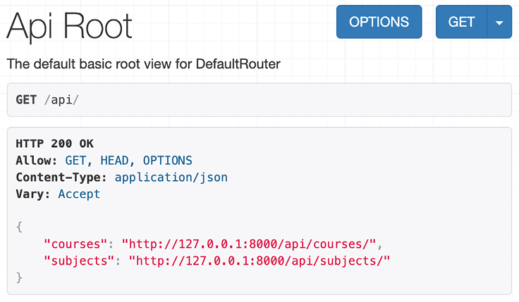

Figure 15.9 The API Root page of the REST framework browsable API

### Building custom API views

## The CourseEnrollView view handles user enrollment in courses. The preceding code is as follows:

1. You create a custom view that subclasses APIView .

2. You define a post() method for POST actions. No other HTTP method will be allowed for this view.

3. You expect a pk URL parameter containing the ID of a course. You retrieve the course by the given pk parameter and raise a 404 exception if it’s not found.

4. You add the current user to the students many-to-many relationship of the Course object and return a successful response.

### Handling authentication

## DRF provides the following authentication backends:
- BasicAuthentication 
- TokenAuthentication 
- SessionAuthentication 
- RemoteUserAuthentication 

### Implementing basic authentication

## DRF includes a permission system to restrict access to views. 
- AllowAny 
- IsAuthenticated 
- IsAuthenticatedOrReadOnly 
- DjangoModelPermissions 
- DjangoObjectPermissions 

# If users are denied permission, they will usually get one of the following HTTP error codes:
- HTTP 401 : Unauthorized
- HTTP 403 : Permission denied

### Adding additional actions to ViewSets

## The preceding code is as follows:

1. You use the action decorator of the framework with the parameter detail=True to specify that this is an action to be performed on a single object.

2. The decorator allows you to add custom attributes for the action. You specify that only the post() method is allowed for this view and set the authentication and permission classes.

3. You use self.get_object() to retrieve the Course object.

4. You add the current user to the students many-to-many relationship and return a custom success response.

### Creating custom permissions

## Only students enrolled on a course should be able to access its contents:
- has_permission() : A view-level permission check
- has_object_permission() : An instance-level permission check

### Serializing course contents

## The description of this method is as follows:

1. You use the action decorator with the parameter detail=True to specify an action that is performed on a single object.

2. You specify that only the GET method is allowed for this action.

3. You use the new CourseWithContentsSerializer serializer class that includes rendered course contents.

4. You use both IsAuthenticated and your custom IsEnrolled permissions. By doing so, you make sure that only users enrolled in the course are able to access its contents.

5. You use the existing retrieve() action to return the Course object.

### Consuming the RESTful API

# Install the Requests library with the following command: 
- python -m pip install requests==2.31.0

# Create a new directory next to the educa project directory and name it api_examples . 
api_examples/
             enroll_all.py
                       educa/
...

## In this code, you perform the following actions:

1. You import the Requests library and define the base URL for the API and the URL for the course list API endpoint.

2. You define the available_courses empty list.

3. You use a while statement to paginate over all result pages.

4. You use requests.get() to retrieve data from the API by sending a GET request to the URL http://127.0.0.1:8000/api/courses/ . This API endpoint is publicly accessible, so it does not require any authentication.

5. You use the json() method of the response object to decode the JSON data returned by the API.

6. You store the next attribute in the url variable to retrieve the next page of results in the while statement.

7. You add the title attribute of each course to the available_courses list.

8. When the url variable is None , you go to the latest page of results and you don’t retrieve any additional pages.

9. You print the list of available courses.

# Start the development server from the educa project:
- python manage.py runserver

# In another cmd, run:
- python enroll_all.py

## With the new code, you perform the following actions:

1. You define the username and password of the student you want to enroll in   courses.

2. You iterate over the available courses retrieved from the API.

3. You store the course ID attribute in the course_id variable and the title attribute in the course_title variable.

4. You use requests.post() to send a POST request to the URL 
http://127.0.0.1:8000/api/courses/[id]/enroll/ for each course. This URL corresponds to the CourseEnrollView API view, which allows you to enroll a user in a course. You build the URL for each course using the course_id variable. The CourseEnrollView view requires authentication. It uses the IsAuthenticated permission and the BasicAuthentication authentication class. The Requests library supports HTTP basic authentication out of the box. You use the auth parameter to pass a tuple with the username and password to authenticate the user, using HTTP basic authentication.

5. If the status code of the response is 200 OK , you print a message to indicate that the user has been successfully enrolled in the course.

Run the following command from the api_examples/ directory:
- python enroll_all.py

---

### Chapter 16. Building a Chat Server

## In this chapter, you will:

- Add Channels to your project
- Build a WebSocket consumer and appropriate routing
- Implement a WebSocket client
- Enable a channel layer with Redis
- Make your consumer fully asynchronous
- Persist chat messages into the database

## Functional overview

### Figure 16.1 Diagram of functionalities built in this chapter

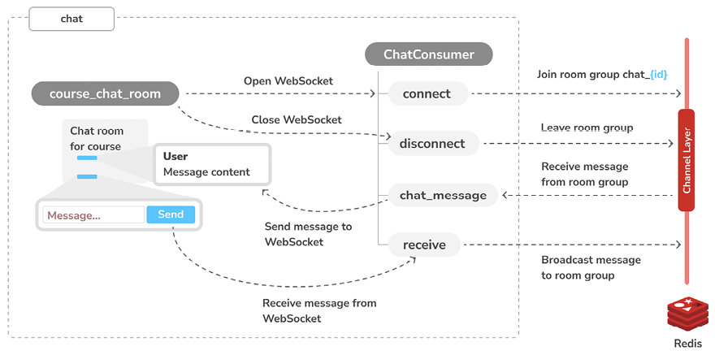

Figure 16.1 Diagram of functionalities built in this chapter

### Creating a chat application

# Create chatthe new application file structure:
django-admin startapp chat

# Update settings.py
- Add `chat.apps.ChatConfig` to `INSTALLED_APPS`

### Implementing the chat room view

## This is the course_chat_room view. 

1. The view receives a required course_id parameter that is used to retrieve the course with the given id .

2. The courses that the user is enrolled in are retrieved through the courses_joined relationship and the course with the given id is obtained from that subset of courses. If the course with the given id does not exist or the user is not enrolled in it, an HttpResponseForbidden response is returned, which translates to an HTTP response with status 403 .

3. If the course with the given id exists and the user is enrolled in it, the chat/room.html template is rendered, passing the course object to the template context.

# Create the following file structure within the chat application directory:
templates/
          chat/
              room.html

## This is the template for the course chat room. In this template, you perform the following actions:

1. You extend the base.html template of your project and fill its content block.

2. You define a 
 HTML element with the chat ID that you will use to display the chat messages sent by the user and by other students.

3. You also define a second 
 element with a text input and a submit button that will allow the user to send messages.

4. You add the include_js and domready blocks defined in the base.html template, which you are going to implement later, to establish a connection with a WebSocket and send or receive messages.

# Open http://127.0.0.1:8000/chat/room/1/ 

### Figure 16.2 The course chat room page

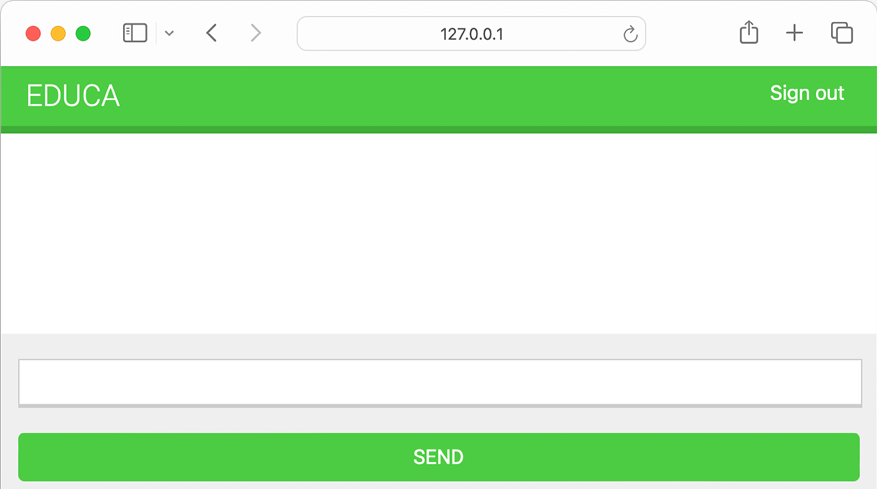

Figure 16.2 The course chat room page

### Real-time Django with Channels

### Asynchronous applications using ASGI

### The request/response cycle using Channels

### Figure 16.3 The Django request-response cycle

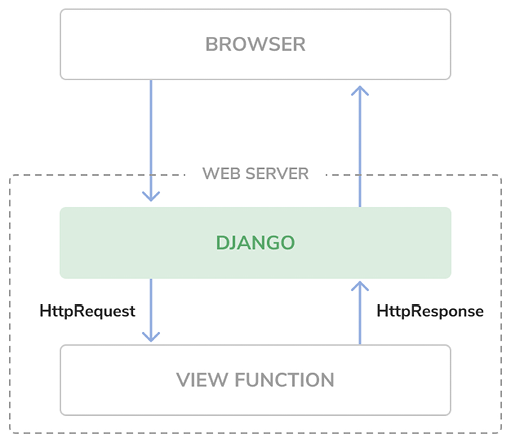

Figure 16.3 The Django request-response cycle

### Figure 16.4 The Django Channels request-response cycle

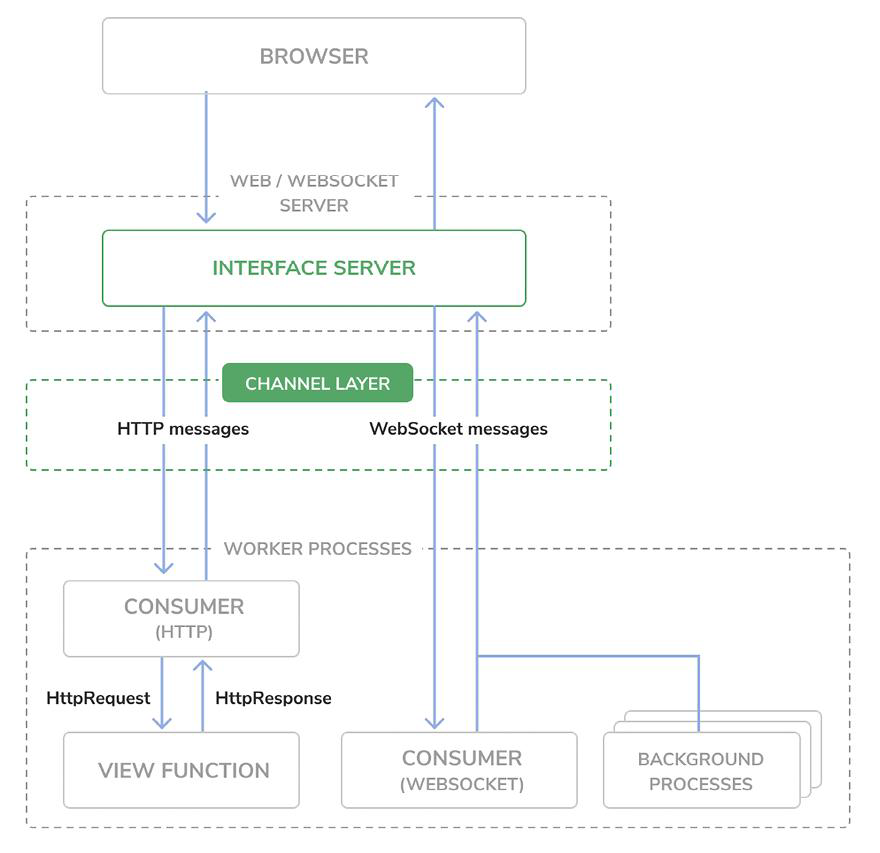

Figure 16.4 The Django Channels request-response cycle

# Installing Channels and Daphne

# Install Channels in your virtual environment with the following command:
- python -m pip install -U 'channels[daphne]==4.1.0'  

# Update settings.py
- Add `daphne` to `INSTALLED_APPS`

## To implement the chat server for your project, you will need to take the following steps:

1. Set up a consumer

2. Configure routing

3. Implement a WebSocket client

4. Enable a channel layer

### Writing a consumer

## This is the ChatConsumer consumer:
- connnect() 
	a. self.accept()
	b. self.close() 
- disconnect() 
- receive() 

### Routing

### Implementing the WebSocket client

## You will perform the following tasks related to the WebSocket client:

1. Open a WebSocket connection with the server when the page is loaded.

2. Add messages to an HTML container when data is received through the WebSocket.

3. Attach a listener to the submit button to send messages through the WebSocket when the user clicks the SEND button or presses the Enter key.

# Open the URL http://127.0.0.1:8000/chat/room/1/ in your browser, you should see two lines, including WebSocket HANDSHAKING and WebSocket CONNECT , like the following output:
- HTTP GET /chat/room/1/ 200 [0.02, 127.0.0.1:57141]
- WebSocket HANDSHAKING /ws/chat/room/1/ [127.0.0.1:57144]
- WebSocket CONNECT /ws/chat/room/1/ [127.0.0.1:57144]

### Figure 16.5 The browser developer tools showing that the WebSocket connection has been established

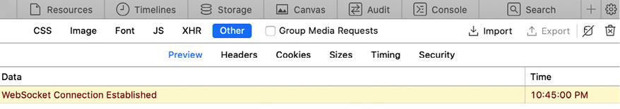

Figure 16.5 The browser developer tools showing that the WebSocket connection has been established

## In this code, you define the following events for the WebSocket client: 
- onmessage 
- onclose 

## When the button is clicked, you perform the following actions:

1. You read the message entered by the user from the value of the text input element with the ID chat-message-input .

2. You check whether the message has any content with if(message) .

3. If the user has entered a message, you form JSON content such as {'message': 'string entered by the user'} by using JSON.stringify() .

4. You send the JSON content through the WebSocket, calling the send() method of chatSocket client.

5. You clear the contents of the text input by setting its value to an empty string with input.value = '' .
6. You return the focus to the text input with input.focus() so that the user can write a new message straight away.

## For any key that the user presses, you perform the following actions:

1. You check whether its key is Enter.

2. If the Enter key is pressed:
	a. You prevent the default behavior for this key with event.preventDefault() .
	b. Then you fire the click event on the submit button to send the message to the WebSocket.

# Open the URL http://127.0.0.1:8000/chat/room/1/ in your browser: 

### Figure 16.6 The chat room page, including messages sent through the WebSocket

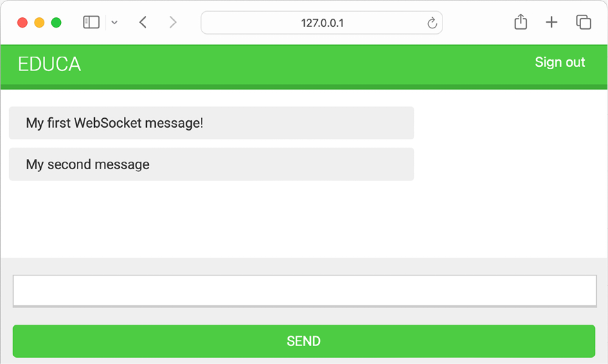

Figure 16.6 The chat room page, including messages sent through the WebSocket

### Enabling a channel layer

## Channels and groups:
- Channel: 
- Group

### Setting up a channel layer with Redis
# Install channels-redis:
- python -m pip install channels-redis==4.2.0

# Update settings.py:
- CHANNEL_LAYERS = {
-     'default': {
-         'Backend': 'channels_redis.core.RedisChannelLayer',
-         'CONFIG': {
-             'host': [('127.0.0.1', 6379)],
-         },
-     },
- }

## RedisChannelLayer  is running on host 127.0.0.1 and the port 6379.

# Initialize the Redis Docker container:
- docker run -it --rm --name redis -p 6379:6379 redis:7.2.4

# Open the Python shell to test
- python manage.py shell

### Updating the consumer to broadcast messages

## In the new connect() method, you perform the following tasks:

1. You retrieve the course id from the scope to know the course that the chat room is associated with. You access self.scope['url_route'] ['kwargs']['course_id'] to retrieve the course_id parameter from the URL. Every consumer has a scope with information about its connection, arguments passed by the URL, and the authenticated user, if any.

2. You build the group name with the id of the course that the group corresponds to. Remember that you will have a channel group for each course chat room. You store the group name in the room_group_name attribute of the consumer.

3. You join the group by adding the current channel to the group. You obtain the channel name from the channel_name attribute of the consumer. You use the group_add method of the channel layer to add the channel to the group. You use the async_to_sync() wrapper to use the channel layer asynchronous method.

4. You keep the self.accept() call to accept the WebSocket connection. When the ChatConsumer consumer receives a new WebSocket connection, it adds the channel to the group associated with the course in its scope. The consumer is now able to receive any messages sent to the group.

You use the async_to_sync() wrapper to use the channel layer asynchronous method. 
- type 
- message 

# Open the URL http://127.0.0.1:8000/chat/room/1/ in your browser. 

### Figure 16.7 The chat room page with messages sent from different browser windows

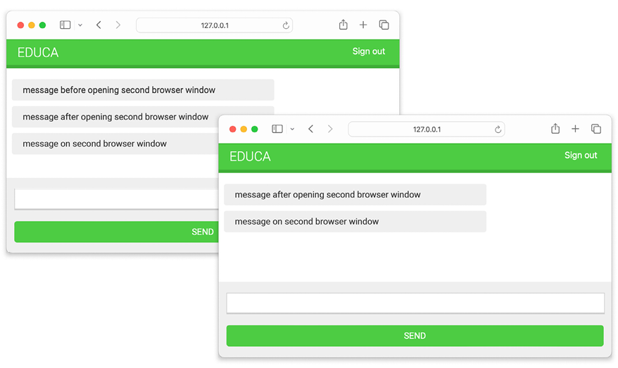

Figure 16.7 The chat room page with messages sent from different browser windows

### Adding context to the messages

## In this code, you implement the following changes:

1. You convert the datetime received in the message to a JavaScript Date object and format it with a specific locale.
2. You compare the username received in the message with two different constants as helpers to identify the user.

3. The constant source gets the value me if the user sending the message is the current user, or other otherwise.

4. The constant name gets the value Me if the user sending the message is the current user or the name of the user sending the message otherwise. You use it to display the name of the user sending the message.

5. You use the source value as a class of the main 
 message element to differentiate messages sent by the current user from messages sent by others. Different CSS styles are applied based on the class attribute. These CSS styles are declared in the css/base.css static file.

6. You use the username and the datetime in the message that you append to the chat log.

# Open the URL http://127.0.0.1:8000/chat/room/1/ in your browser. replacing 1 with the id of an existing course in the database.

### Figure 16.8 The chat room page with messages from two different user sessions

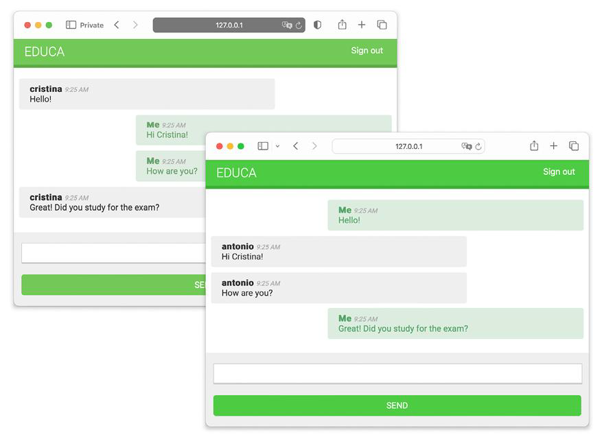

Figure 16.8 The chat room page with messages from two different user sessions

### Modifying the consumer to be fully asynchronous

## You have implemented the following changes:

1. The ChatConsumer consumer now inherits from the AsyncWebsocketConsumer class to implement asynchronous calls.

2. You have changed the definition of all methods from def to async def .

3. You use await to call asynchronous functions that perform I/O operations.

4. You no longer use the async_to_sync() helper function when calling methods on the channel layer.

text'''
Open the URL http://127.0.0.1:8000/chat/room/1/ with two different browser windows again. and verify that the chat server still works. The chat server is now fully asynchronous!
'''
### Persisting messages into the database

## To implement the chat history functionality, we will follow these steps:

1. We will create Django model to store chat messages and add it to the administration site.

2. We will modify the WebSocket consumer to persist messages.

3. We will retrieve the chat history to display the latest messages when users enter a chat room.

### Creating a model for chat messages

## This is the data model to persist chat messages. Let’s take a look at the fields of the Message model:
- user 
- course 
- content 
- sent_on 

# Migrations for the chat application:
- python manage.py makemigrations chat
- python manage.py migrate

### Adding the message model to the administration site

### Figure 16.9 The Chat application and Messages section on the administration site

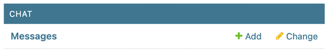

Figure 16.9 The Chat application and Messages section on the administration site

### Storing messages in the database

# open http://127.0.0.1:8000/chat/room/1/. Then, open a second browser window in incognito mode to prevent the use of the same session.

### Figure 16.10 Chat room example with messages sent by two different users

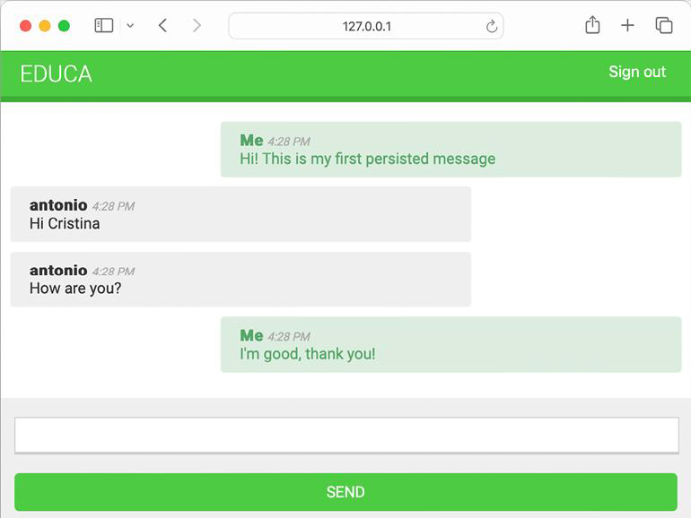

Figure 16.10 Chat room example with messages sent by two different users

# Open http://127.0.0.1:8000/admin/chat/message/ in your browser. 

### Figure 16.11 Admin list display view of messages stored in the database

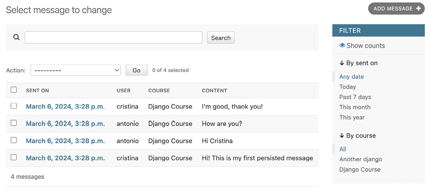

Figure 16.11 Admin list display view of messages stored in the database

### Displaying the chat history

# Open http://127.0.0.1:8000/chat/room/1/ in your browser. 

### Figure 16.12 Chat room initially displaying the latest messages

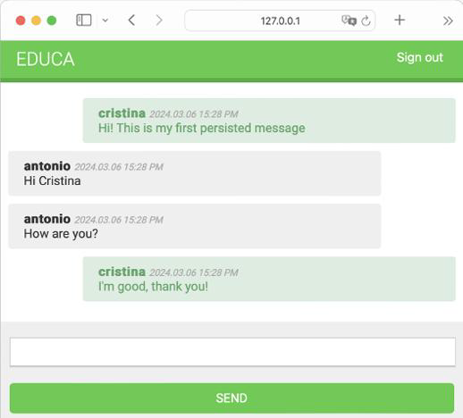

Figure 16.12 Chat room initially displaying the latest messages

# Open the browser and access any course that the student is enrolled in to view the course contents.
 
### Figure 16.13 The course detail page, including a link to the course chat room

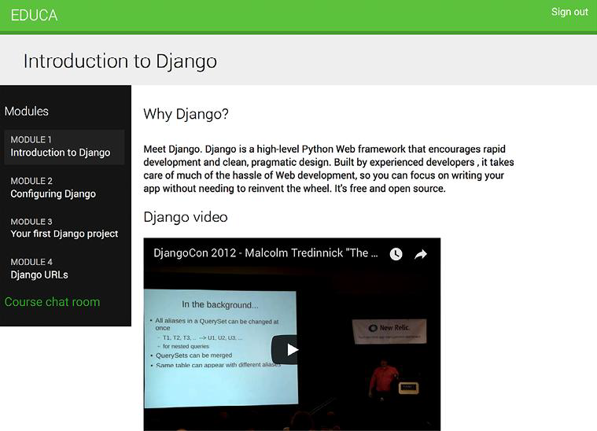

Figure 16.13 The course detail page, including a link to the course chat room

---

### Chapter 17. Going Live

## This chapter will cover the following topics:
- Configuring Django settings for multiple environments
- Using Docker Compose to run multiple services
- Setting up a web server with uWSGI and Django
- Serving PostgreSQL and Redis with Docker Compose
- Using the Django system check framework
- Serving NGINX with Docker
- Serving static assets through NGINX
- Securing connections through Transport Layer Security (TLS) / Secure Sockets Layer (SSL)
- Using the Daphne Asynchronous Server Gateway Interface (ASGI) server for Django Channels
- Creating a custom Django middleware
- Implementing custom Django management commands

### Creating a production environment

### Managing settings for multiple environments

## We will manage the following environments:
- local 
- prod 

text'''
Create a settings/ directory next to the settings.py file of the educa project. Rename the settings.py file to base.py and move it into the new settings/ directory.
'''
# Create the following additional files inside the settings/ folder so that thenew directory looks as follows:
settings/
          __init__.py
         base.py
         local.py
         prod.py

## These files are as follows:
- base.py 
- local.py 
- prod.py 

# Edit the settings/base.py file and replace the following line:
BASE_DIR = Path(__file__).resolve().parent.parent

# Replace the preceding line with the following one:
BASE_DIR = Path(__file__).resolve().parent.parent.parent

# Update settings.py
- from .base import *
- DEBUG = True
- DATABASES = {
-     'default': {
-         'ENGINE': 'django.db.backends.sqlite3',
-         'NAME': BASE_DIR / 'db.sqlite3',
-     }
- }

# Django management commands won’t automatically detect the settings file to use because the project settings file is not the default settings.py file:
- python manage.py runserver --settings=settings.local

### Running the local environment

# Let’s run the local environment using the new settings structure (cmd). 
- docker run -it --rm --name redis -p 6379:6379 redis:7.2.4

# Run the following management command in another shell, from the project directory:
- python manage.py runserver --settings=educa.settings.local

# Open http://127.0.0.1:8000/ in your browser and check that the site loads correctly. 
If you are using Windows, you can execute the following command in the shell:
# set DJANGO_SETTINGS_MODULE=educa.settings.local

test'''Stop the Django development server from the shell by pressing the Ctrl + C keys and stop the Redis Docker container from the shell by also pressing the Ctrl + C keys.
'''
The local environment works well. Let’s prepare the settings for the production environment.

### Production environment settings

# Update settings.py
- from .base import *

- DEBUG = False
- ADMINS = [
-     ('jim WD', 'jim.webdeveloper57@gmail.com'),
- ]

- ALLOWED_HOSTS = ['*']

- DATABASES = {
-     'default': {
-         'ENGINE': 'django.db.backends.sqlite3',
-         'NAME': BASE_DIR / 'db.sqlite3',
-     }
- }

## These are the settings for the production environment:
- DEBUG 
- ADMINS 
- ALLOWED_HOSTS 
- DATABASES 

- Using Docker Compose

## We will use Docker Compose to build and run multiple Docker containers.

## You will initially define the following three services and you will add additional services in the next sections:
- Web service
- Database service
- Cache service

### Installing Docker Compose via Docker Desktop

## Install Docker Desktop by following the instructions at
https://docs.docker.com/compose/install/composedesktop/.

# Open the Docker Desktop application and click on Containers. It will look as follows:

### Figure 17.1 The Docker Desktop interface

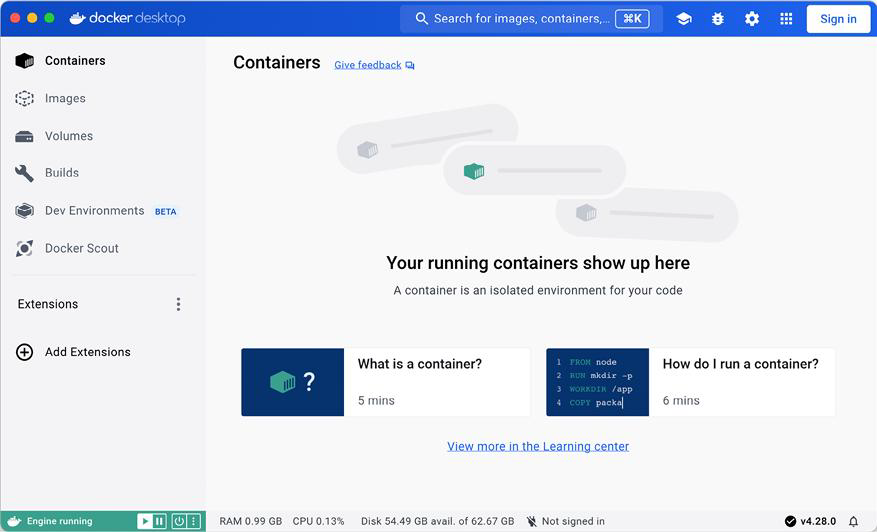

Figure 17.1 The Docker Desktop interface

After installing Docker Compose, you need to create a Docker image for your Django project.

### Creating a Dockerfile

## This code performs the following tasks:

1. The Python 3.12.6 parent Docker image is used. You can find the official Python Docker image at https://hub.docker.com/_/python.

2. The following environment variables are set:
	a. PYTHONDONTWRITEBYTECODE 
	b. PYTHONUNBUFFERED 

3. The WORKDIR command is used to define the working directory of the image.

4. The pip package of the image is upgraded.

5. The requirements.txt file is copied to the working directory (. ) of the parent Python image.

6. The Python packages in requirements.txt are installed in the image using pip .

7. The Django project source code is copied from the local directory to the working directory (. ) directory of the image.

# Create a requirements.txt file:
- asgiref==3.8.1
- Django==5.2
- Pillow~=11.2
- sqlparse==0.5.0
- django-braces==1.15.0
- django-embed-video==1.4.9
- pymemcache==4.0.0
- django-debug-toolbar==4.3.0
- redis==5.0.4
- django-redisboard==8.4.0
- djangorestframework==3.15.1
- requests==2.31.0
- channels[daphne]==4.1.0
- channels-redis==4.2.0
- psycopg==3.1.18
- uwsgi==2.0.25.1
- python-decouple==3.8
- setuptools>=65,<82 

# In addition to the Python packages that you installed in the previous chapters, the 
requirements.txt file includes the following packages:
- psycopg 
- uwsgi 
- python-decouple : Package to load environment variables easily.

### Creating a Docker Compose file

## YAML is a human-readable data-serialization language. 

## In this file, you define a web service:
- build 
- command 
- restart 
- volumes 
- ports 
- environment 

# Open a cmd in the parent directory, where the docker-compose.yml file is located, and run the following command:
- docker compose up -d if a file can’t not be find just run docker compose up -d --build

# Open http://0.0.0.0:8000/admin/ with your browser. 

### Figure 17.2 The Django administration site login form with no CSS styles applied

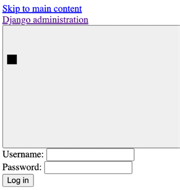

Figure 17.2 The Django administration site login form with no CSS styles applied

### Figure 17.3 The chapter17 application and the web-1 container in Docker Desktop

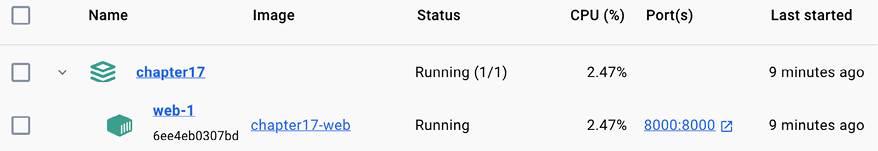

Figure 17.3 The chapter17 application and the web-1 container in Docker Desktop

### Figure 17.4 The chapter17 application and the web-1 container in Docker Desktop

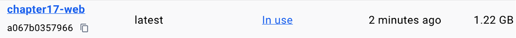

Figure 17.4 The chapter17 application and the web-1 container in Docker Desktop

### Configuring the PostgreSQL service

## With these changes, you define a service named db with the following subsections:
- image 
- restart 
- volumes 
- environment 

# Update settings\base.py
- from decouple import config
- from .base import *

- DEBUG = False

- ADMINS = [
-     ('jim WD', 'jim.webdeveloper57@gmail.com'),
- ]

- ALLOWED_HOSTS = ['*']

- DATABASES = {
-     'default': {
-        'ENGINE': 'django.db.backends.postgresql',
-        'NAME': config('POSTGRES_DB'),
-        'USER': config('POSTGRES_USER'),
-        'PASSWORD': config('POSTGRES_PASSWORD'),
-        'HOST': 'db',
-        'PORT': 5432,
-     }
- }

## In the production settings file, you use the following settings:
- ENGINE 
- NAME , USER , and PASSWORD 
- HOST 
- PORT 

# Stop the Docker application from the shell by pressing the Ctrl + C keys, start Compose again with the following command:
- docker compose up

### Applying database migrations and creating a superuser

## Migrate
docker compose exec web python /code/manage.py migrate

## Create a createsuperuser
- docker compose exec web python /code/manage.py createsuperuser 

### Configuring the Redis service

## In the previous code, you define the cache service with the following subsections:
- image 
- restart : The restart policy is set to always .
- volumes 

# Edit the educa/settings/prod.py file:
- REDIS_URL = 'redis://cache:6379'
- CACHES['default']['LOCATION'] = REDIS_URL
- CHANNEL_LAYERS['default']['CONFIG']['hosts'] = [REDIS_URL]

text'''
In these settings, you use the cache hostname that is automatically generated by Docker Compose using the name of the cache service and port 6379 used by Redis. You modify the Django CACHE setting and the CHANNEL_LAYERS setting used by Channels to use the production Redis URL.
'''

# Stop the Docker application from the shell by pressing the Ctrl + C keys. Then, start Compose again with the following command:
- docker compose up

### Figure 17.5 The chapter17 application with the db-1, web-1, and cache-1 containers in Docker Desktop

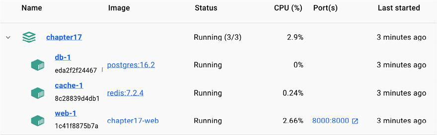

Figure 17.5 The chapter17 application with the db-1, web-1, and cache-1 containers in Docker Desktop

### Serving Django through WSGI and NGINX

### Using uWSGI

### Configuring uWSGI

## Next to the docker-compose.yml file, create the config/uwsgi/uwsgi.ini file path. 

         config/
                uwsgi/
        uwsgi.ini
        Dockerfile
        docker-compose.yml
        educa/
               manage.py
               ...
        requirements.txt

## In the uwsgi.ini file, you define the following options:
- socket 
- chdir 
- module 
- master : This enables the master process.
- chmod-socket 
- uid 
- gid 
- vacuum : Using true instructs uWSGI to clean up any temporary files or UNIX sockets it creates.

### Using NGINX

## You have added the definition for the nginx service with the following subsections:
- image 
- restart 
- volumes 
- ports 

### Let’s configure the NGINX web server.

### Configuring NGINX

## This is the basic configuration for NGINX:

1.You tell NGINX to listen on port 80 .

2. You set the server name to both www.educaproject.com and educaproject.com . NGINX will serve incoming requests for both domains.

3. You use stderr for the error_log directive to get error logs written to the standard error file. The second parameter determines the logging level. You use warn to get warnings and errors of higher severity.

4. You point access_log to the standard output with /dev/stdout .

5. You specify that any request under the / path has to be routed with the uwsgi_app socket to uWSGI.

6. You include the default uWSGI configuration parameters that come with NGINX. These are located at /etc/nginx/uwsgi_params .

# Stop the Docker and restart it:
- docker compose up

# Open the http://localhost/ URL in your browser, with no CSS styles:

### Figure 17.6 The course list page served with NGINX and uWSGI

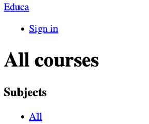

Figure 17.6 The course list page served with NGINX and uWSGI

### Figure 17.7 The production environment request - response cycle

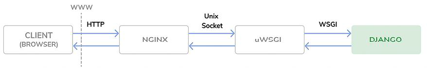

Figure 17.7 The production environment request - response cycle

## The following happens when the client browser sends an HTTP request:

1. NGINX receives the HTTP request.

2. NGINX delegates the request to uWSGI through a socket.

3. uWSGI passes the request to Django for processing.

4. Django returns an HTTP response that is passed back to NGINX, which in turn passes it back to the client browser.

## If you check the Docker Desktop application, you should see that there are four containers running:
- The db service is running PostgreSQL
- The cache service is running Redis
- The web service is running uWSGI and Django
- The nginx service is running NGINX

### Using a hostname

# Edit the C:\Windows\System32\drivers\etc file and add the same line.

1. Open Notepad as Administrator

2. Open the hosts file

3. File type: All files (.)

4. Open:hosts

5. Add this line at the bottom:
127.0.0.1 educaproject.com
127.0.0.1 www.educaproject.com

6. Run:http://educaproject.com

# Restrict the hosts that can serve your Django project. Edit the educa/settings/prod.py:
- ALLOWED_HOSTS = ['educaproject.com', 'www.educaproject.com']

### Serving static and media assets

# Edit the settings/base.py file: 
- STATIC_URL = 'static/'
- STATIC_ROOT = BASE_DIR / 'static'

### Collecting static files

# Stop the Docker, restart it: 
- docker compose up

# Open another cmd: 
- docker compose exec web python /code/manage.py collectstatic 

### Serving static files with NGINX

# Edit the config/nginx/default.conf.template file: 
-     # ...
-     location /static/ {
        alias /code/static/;
-     }
-     location /media/ {
        alias /code/media/;
-     }
- }

These directives tell NGINX to serve static files located under: 
- /static/ 
- /media/ 

### Figure 17.8 The production environment request/response cycle, including static files

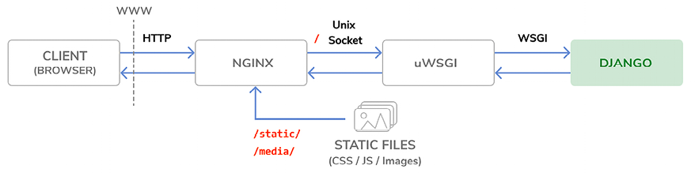

Figure 17.8 The production environment request/response cycle, including static files

# Stop the Docker, restart it:
- docker compose up

# Open http://educaproject.com/ in your browser. You should see the following screen:

### Figure 17.9 The course list page served with NGINX and uWSGI

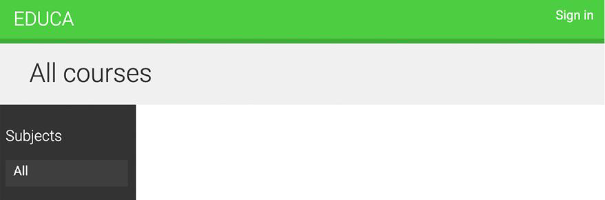

Figure 17.9 The course list page served with NGINX and uWSGI

### Securing your site with SSL/TLS

## Checking your project for production

# Let’s confirm that the check framework does not raise any issues for your project. 
- Docker compose exec web python manage.py check --settings=educa.settings.prod

# Edit the educa/settings/prod.py settings file. 

# Run the following command from the main directory of your project:
- docker compose exec web python manage.py check --deploy --settings=educa.settings.prod

### Creating an SSL/TLS certificate

# Run on your terminal if you’re using Windows:
- docker run --rm -v ${PWD}/ssl:/ssl alpine/openssl req -x509 -newkey rsa:2048 -sha256 -days 3650 -nodes -keyout /ssl/educa.key -out /ssl/educa.crt -subj "/CN=*.educaproject.com" -addext "subjectAltName=DNS:*.educaproject.com"

### Configuring NGINX to use SSL/TLS

- The NGINX container host will be accessible through port 80 (HTTP) and port 443 (HTTPS). T

# Edit the config/nginx/default.conf.template file. 

# Stop the Docker and restart it:
- docker compose up

# Open https://educaproject.com/ with your browser.

### Figure 17.10 An invalid certificate warning

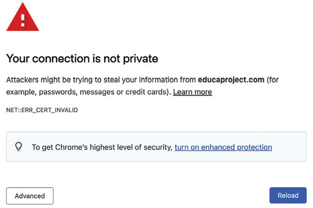

Figure 17.10 An invalid certificate warning

### Figure 17.11 The browser address bar, including a secure connection padlock icon

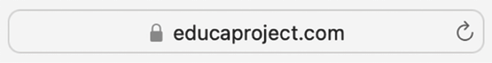

Figure 17.11 The browser address bar, including a secure connection padlock icon

### Figure 17.12 The browser address bar, including a warning message

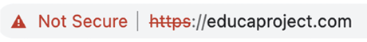

Figure 17.12 The browser address bar, including a warning message

### Redirecting HTTP traffic over to HTTPS

## Edit the config/nginx/default.conf.template file.

# Open a shell in the parent directory, and run the following command to reload NGINX:
- docker compose exec nginx nginx -s reload
 
### Configuring Daphne for Django Channels

## The daphne service definition is very similar to the web service:

- working_dir changes the working directory of the image to /code/educa/ .

- command runs the educa.asgi:application application defined in the educa/asgi.py file with daphne in the 0.0.0.0 hostname and port 9001 . It also uses the wait-for-it bash script to wait for the PostgreSQL database to be ready before initializing the web server.

### Using secure connections for WebSockets

## Including Daphne in the NGINX configuration

### Figure 17.13 The production environment request - response cycle, including Daphne

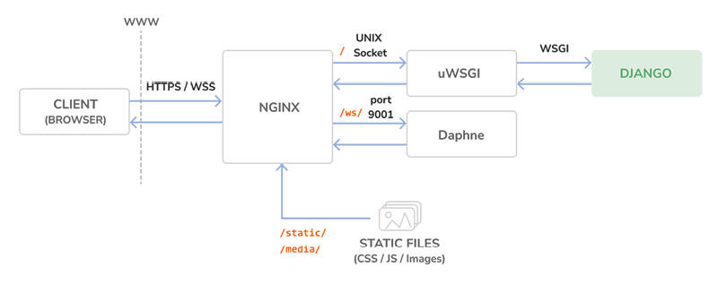

Figure 17.13 The production environment request - response cycle, including Daphne

# Stop the Docker and restart it:
- docker compose up

### Figure 17.14 Course chat room messages served with NGINX and Daphne

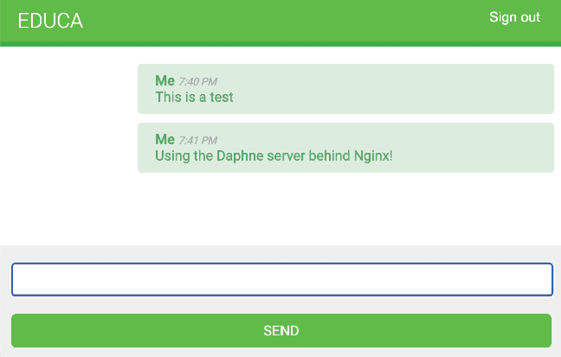

Figure 17.14 Course chat room messages served with NGINX and Daphne

### Creating a custom middleware

### Figure 17.15 Middleware execution in Django

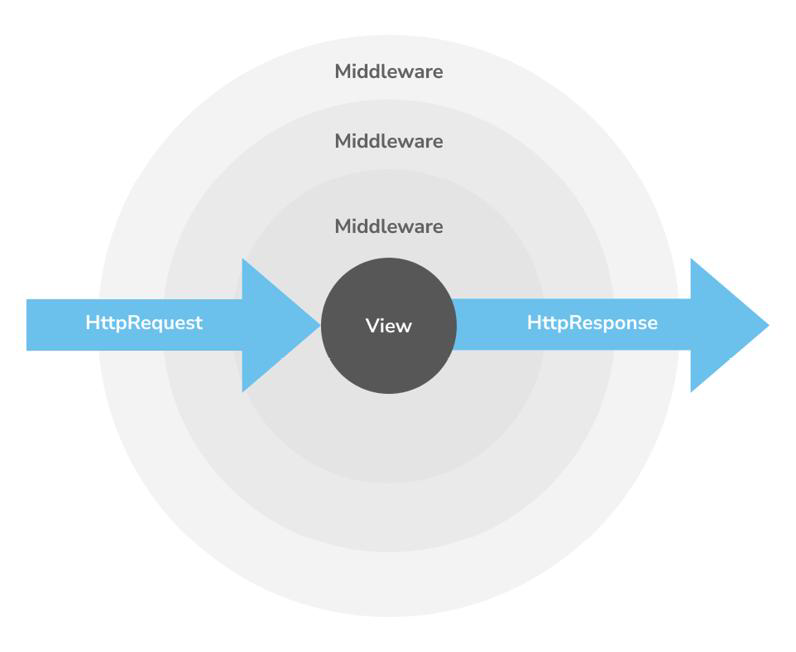

Figure 17.15 Middleware execution in Django

### Figure 17.16 Execution order for default middleware components

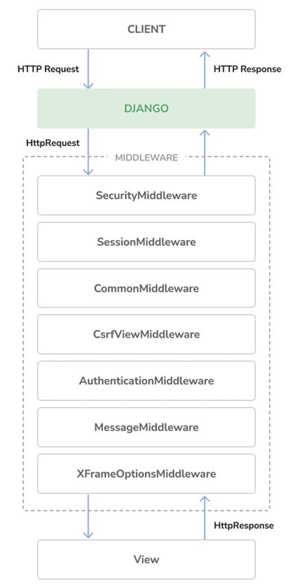

Figure 17.16 Execution order for default middleware components

### Creating subdomain middleware

## When an HTTP request is received, you perform the following tasks:

1. You get the hostname that is being used in the request and divide it into parts. For example, if the user is accessing mycourse.educaproject.com , you generate the ['mycourse', 'educaproject', 'com'] list.

2. You check whether the hostname includes a subdomain by checking whether the split generated more than two elements. If the hostname includes a subdomain, and this is not www , you try to get the course with the slug provided in the subdomain.

3. If a course is not found, you raise an HTTP 404 exception. Otherwise, you redirect the browser to the course detail URL.

# Edit the settings/base.py file of the project:
- MIDDLEWARE = [
-     # …
-     'courses.middleware.subdomain_course_middleware',
- ]

# Edit the educa/settings/prod.py file and modify the ALLOWED_HOSTS setting, as follows:
- ALLOWED_HOSTS = ['.educaproject.com']

- Edit the config/nginx/default.conf.template file at these two occurrences:
- server_name www.educaproject.com educaproject.com;
- Replace the occurences of the preceding line with the following one:
server_name *.educaproject.com educaproject.com;

### Implementing custom management commands

## Create the following file structure inside the students application directory:
management/
          __init__.py
         commands/
                    __init__.py
                   enroll_reminder.py

### Edit the enroll_reminder.py file

## This is your enroll_reminder command. The preceding code is as follows:

- The Command class inherits from BaseCommand.

- You include a help attribute. This attribute provides a short description of the command that is printed if you run the python manage.py help enroll_reminder command.

- You use the add_arguments() method to add the --days named argument. This argument is used to specify the minimum number of days a user has to be registered, without having enrolled in any course, in order to receive the reminder.

- The handle() command contains the actual command. You get the days attribute parsed from the command line. If this is not set, you use 0 , so that a reminder is sent to all users that haven’t enrolled on a course, regardless of when they registered. You use the timezone utility provided by Django to retrieve the current timezone-aware date with timezone.now().date() . (You can set the timezone for your project with the TIME_ZONE setting.) You retrieve the users who have been registered for more than the specified days and are not enrolled in any courses yet. You achieve this by annotating the QuerySet with the total number of courses each user is enrolled in. You generate the reminder email for each user and append it to the emails list. Finally, you send the emails using the send_mass_mail() function, which is optimized to open a single SMTP connection for sending all emails, instead of opening one connection per email sent.

# Open the cmd and run your command:
-docker compose exec web python manage.py enroll_reminder --days=20 --settings=educa.settings.prod

text'''
If you don’t have a local SMTP server running, you can look at Chapter 2, Enhancing Your Blog with Advanced Features, where you configured the SMTP settings for your first Django project. Alternatively, you can add the following setting to the base.py file to make Django output emails to the standard output during development:
EMAIL_BACKEND = 'django.core.mail.backends.console.EmailBackend'
'''
text'''
Django also includes a utility to call management commands using Python.
You can run management commands from your code as follows:
from django.core import management
management.call_command('enroll_reminder', days=20)
'''

### 🎥 GIF Django_preview.

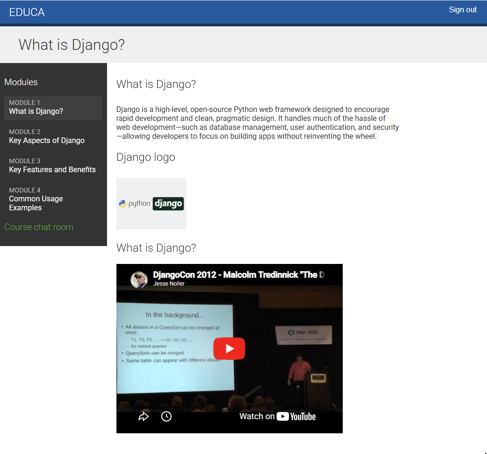

GIF Video play

### 🎥 GIF Python_preview.

GIF Video play

### 🎥 GIF Chat room Preview

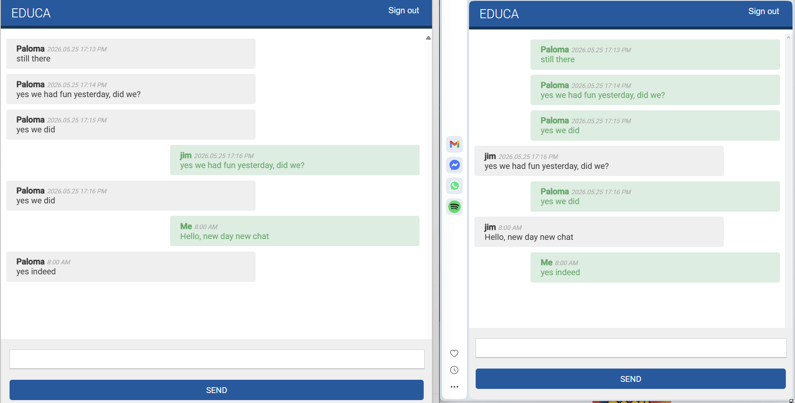

GIF Chat room Preview

## 🔗 Related Repository

This project includes a code repository documenting the full development implementation.

👉 https://github.com/jeanmarc-webdev/building-an-e-Learning